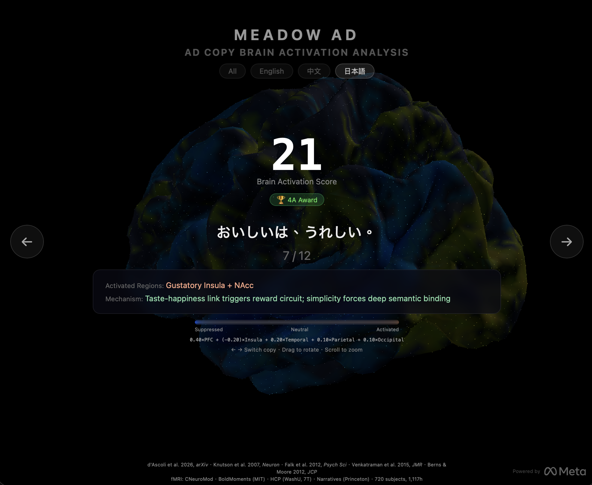

# Meadow AD — Ad Copy Brain Activation Analysis

> Predict which advertising copy activates the most brain regions — powered by Meta's TRIBE v2 brain encoding foundation model.

<p align="center">
  
</p>

## What This Does

This project takes advertising copy (text) and predicts **how the human brain would respond** to reading it. Kai's Meadow AD (powered by [Meta TRIBE v2](https://ai.meta.com/blog/tribe-v2-brain-predictive-foundation-model/)) maps text, image, video, and audio through brain encoding models to predict activation across 20,484 cortical voxels.

The pipeline:

```
Ad Copy → LLaMA 3.2 (text features) → Meadow AD Brain Encoder → 20,484 cortical voxels
```

Each voxel maps to a specific location on the brain's surface (fsaverage5 atlas). By comparing activation patterns across different ad copies, we can identify which copy produces the **strongest** and most **unique** brain response.

### Key Insight

**Not all text activates the brain equally.** Tested on real award-winning slogans:

| Score | Slogan | Activated Regions | Why It Works |
|-------|--------|-------------------|-------------|
| 🟢 100% | "Trust me, you can make it!" (媚登峰) | vmPFC + NAcc + Motor | Trust triggers social cognition; encouragement activates reward + action planning |
| 🟢 97% | "Where's the Beef?" (Wendy's) | PFC + ACC + Amygdala | Question forces cognitive processing; challenges competitor triggering conflict detection |
| 🟢 89% | "先誠實，再成交" (永慶房屋 2021 永恆金句) | vmPFC + ACC | Honesty activates value judgment; promise structure triggers trust circuit |
| 🟡 36% | "猶豫 是對自己太客氣" (必爾斯藍基 2020) | Amygdala + PFC | Reframes hesitation as self-neglect; triggers loss aversion |
| 🔴 0% | "解放玩心 禁止小心" (恆隆行 2024) | Language area only | Abstract wordplay — minimal emotional or reward activation |

> Benchmark: 66 slogans from Cannes Lions, 4A Awards, and Taiwan 廣告流行語金句獎 (2016-2024). Scored using [Knutson 2007](https://pubmed.ncbi.nlm.nih.gov/17196537/) purchase prediction formula, calibrated with Ridge Regression on award-winning slogans (R²=0.66).

## Live Demo

```bash
cd demo
python -m http.server 8899
# Open http://localhost:8899
```

Interactive 3D brain viewer:
- Click through ad copies to see activation patterns
- Red = activated regions, Blue = suppressed, Gray = neutral
- Score ranking from highest to lowest brain response
- Heatmap showing activation distribution

## How It Works

### Architecture

```
                    ┌─────────────┐
  Ad Copy ─────────▶│ LLaMA 3.2   │──▶ Hidden States (layers 0.5, 1.0)
  (Chinese/English)  │ 3B, 4-bit   │    shape: (1, 6144)
                    └──────┬──────┘
                           │
                    ┌──────▼──────┐
                    │ Text        │──▶ Projected features
                    │ Projector   │    shape: (1, 384)
                    └──────┬──────┘
                           │
                    ┌──────▼──────┐
                    │ Brain       │──▶ Brain encoding
                    │ Encoder     │    8-layer Transformer
                    │ (Meadow AD)  │    shape: (1, 1152)
                    └──────┬──────┘
                           │
                    ┌──────▼──────┐
                    │ Cortical    │──▶ 20,484 voxel activations
                    │ Predictor   │    (fsaverage5 surface)
                    └─────────────┘
```

### Scoring Method

Each ad copy is scored by comparing its brain activation pattern to the **average** of all copies:

- **Positive activation**: sum of voxels more active than average
- **Total activation**: sum of absolute differences from average
- **Max activation**: strongest single voxel difference
- **Uniqueness**: standard deviation of the difference map

Higher score = more distinct brain response = more attention-grabbing.

## Project Structure

```
meadow-ad/
├── README.md
├── setup.sh                # One-line setup script
├── requirements.txt
├── demo/
│   ├── index.html          # Three.js 3D brain viewer
│   ├── brain_data.json     # Brain mesh + activation data (66 slogans)
│   └── meta-logo.svg
├── examples/
│   ├── BENCHMARK.md        # Full benchmark: EN vs ZH comparison
│   └── benchmark_results.json  # Machine-readable results
├── scripts/
│   ├── analyze_ads.py      # Main analysis pipeline
│   ├── convert_brain_encoder_mlx.py
│   ├── convert_vjepa2_mlx.py
│   └── convert_wav2vec_mlx.py
├── data/
│   ├── calibration_result.json   # Weight calibration methodology
│   └── scoring_method.json       # Region weights + references
├── docs/
│   └── demo-screenshot.png
└── models/                 # Downloaded via setup.sh (not in git)
```

## Brain Region Reference — Advertising Applications

Complete mapping of brain regions, their functions, advertising effects, and measurability.

### Cortical Regions (Surface)

| Brain Region | Function | Ad Activation Effect | NeuroSky | EEG-AI |
|---|---|---|---|---|
| **Prefrontal Cortex (PFC)** | Decision-making, impulse control | Purchase decisions, brand preference | ✅ Direct | ✅ Native |
| **Orbitofrontal Cortex (OFC)** | Reward value evaluation | "Is this worth buying?" | ⚠️ Partial | ✅ Enhanced (virtual Fp2) |
| **Dorsolateral PFC (DLPFC)** | Rational thinking, working memory | Price comparison, spec evaluation | ⚠️ Partial | ✅ Virtual F3/F4 separates L/R |
| **Ventromedial PFC (vmPFC)** | Brand value, self-identity | "This brand represents me" | ⚠️ Partial | 🔶 Possible (residual in Fp1) |
| **Anterior Cingulate (ACC)** | Conflict detection | "Buy or not buy" hesitation | ❌ | 🔶 Frontal midline theta = ACC marker |
| **Motor Cortex (M1)** | Action execution | "Hand wants to click BUY" | ❌ | ✅ Virtual C3/C4 |
| **Somatosensory (S1)** | Touch, body sensation | Imagining product texture | ❌ | ✅ Virtual C3/C4 |
| **Superior Temporal (STG)** | Speech, music processing | Voiceover/music emotional impact | ❌ | 🔶 Virtual T3/T4 (weak signal) |
| **Fusiform Face Area (FFA)** | Face recognition | Endorser trust building | ❌ | ❌ Too deep + too far |
| **Visual Cortex V1/V4** | Visual processing, color | Color/design attractiveness | ❌ | 🔶 Virtual O1/O2 (needs validation) |
| **MT/V5** | Motion perception | Video dynamic attention capture | ❌ | ❌ Too far |
| **Parietal Lobe** | Spatial attention | Layout, visual flow guidance | ❌ | 🔶 Virtual P3/P4 (difficult) |
| **Intraparietal Sulcus (IPS)** | Number processing | Price/discount calculation | ❌ | ❌ Too deep |
| **Angular Gyrus** | Metaphor comprehension | Understanding brand slogan metaphors | ❌ | ❌ |
| **Broca's Area** | Language production | Urge to recommend to others | ❌ | 🔶 Virtual F7 (possible) |
| **Wernicke's Area** | Language comprehension | Depth of copy understanding | ❌ | ❌ Too far (T3) |

### Subcortical Structures (Deep)

| Brain Region | Function | Ad Activation Effect | NeuroSky | EEG-AI |
|---|---|---|---|---|
| **Nucleus Accumbens (NAcc)** | Desire, reward anticipation | **"I want this"** — key purchase driver | ❌ | ❌ Subcortical |
| **Ventral Tegmental Area (VTA)** | Dopamine release | Excitement, anticipation | ❌ | ❌ Subcortical |
| **Amygdala** | Fear, threat assessment | **"Buy now before it's gone"** urgency | ❌ | 🔶 Indirect (Fp1 gamma changes during fear) |
| **Hippocampus** | Memory formation | **Ad memorability** — will they remember? | ❌ | 🔶 Theta coherence = hippocampal marker |
| **Insula** | Disgust, interoception | **Price pain** "too expensive" vs "must try" | ❌ | ❌ Too deep |
| **Thalamus** | Sensory relay gate | What enters consciousness | ❌ | 🔶 Alpha rhythm originates from thalamus |
| **Basal Ganglia** | Habits, automatic behavior | **Brand loyalty** — choose without thinking | ❌ | ❌ Subcortical |

### Functional Networks

| Network | Function | Ad Effect | Measurable? |
|---|---|---|---|
| **Default Mode (DMN)** | Self-reflection, daydreaming | Imagining yourself using the product | 🔶 EEG-AI |
| **Salience Network (SN)** | Detecting important stimuli | Can the ad break through your scroll? | ✅ NeuroSky (attention spike) |
| **Executive Control (ECN)** | Rational analysis | Reading reviews, comparing prices | ⚠️ Partial |
| **Reward Circuit** | Desire → anticipation → evaluation | Full "see it → want it → worth it" path | ❌ fMRI only / Meadow AD predicted |
| **Mirror Neuron System** | Empathy, imitation | Seeing unboxing → wanting to unbox too | 🔶 EEG-AI |
| **Fear Circuit** | Threat → decision | FOMO → impulse purchase | 🔶 Indirect |

### Ad Strategy → Brain Region Mapping

| Strategy | Primary Regions | Example |
|---|---|---|
| Flash sale / urgency | Amygdala + NAcc | "Last 3 hours" |
| Emotional story | vmPFC + ACC + Mirror neurons | "Mom's eyes teared up" |
| Social proof | Temporoparietal junction + DMN | "20,000 repurchases" |
| Sensory description | Insula + Somatosensory + Olfactory | "Peach + white tea + sea salt" |
| Price anchoring | DLPFC + IPS + Insula | "Department store $3000, ours $265" |
| Celebrity endorsement | FFA + Mirror system | KOL/influencer recommendation |
| Visual impact | V1/V4 + Salience network | High contrast, vivid colors |
| Music/sound | Auditory cortex + Amygdala + Cerebellum | Catchy jingle |
| Question opening | Broca's + ACC | "Are you still...?" |
| Cliffhanger | ACC + DLPFC | "The result was..." |

### Legend

| Symbol | Meaning |
|---|---|
| ✅ | Directly measurable |
| ⚠️ | Partially measurable |
| 🔶 | EEG-AI may infer (needs validation) |
| ❌ | Not measurable with current setup |

### EEG Super-Resolution AI — What It Unlocks

With single-channel Fp1 → AI-reconstructed virtual channels:

| New Capability | Virtual Channel | Value for Advertising |
|---|---|---|
| **Approach/Avoid motivation** | F3 vs F4 asymmetry | Left > Right = "I want this" / Right > Left = "No thanks" |
| **Motor intention** | Virtual C3/C4 Mu suppression | Ready to click "Buy Now" |
| **Visual attention precision** | Virtual O1/O2 Alpha | Exactly when/where eyes engage |
| **Cognitive conflict intensity** | Frontal midline Theta | Strength of "buy or not" hesitation |
| **Memory encoding strength** | Theta coherence | Will they remember this ad tomorrow? |
| **Emotional intensity** | Gamma burst pattern | How strong the emotional reaction is |
| **Arousal level** | Thalamic Alpha rhythm | Overall alertness/engagement |

The most valuable unlock is **Frontal Asymmetry (F3 vs F4)** — the gold standard in consumer neuroscience for measuring "want vs don't want", achievable with just one additional virtual channel.

## Scoring Formula

### Core Finding: Knutson (2007, *Neuron*)

The purchase prediction formula, validated with fMRI:

```
P(Purchase) = NAcc(want) + vmPFC(worth it) − Insula(too expensive)
```

| Brain Region | Function | Direction | β Coefficient | Weight |
|---|---|---|---|---|
| **NAcc (Nucleus Accumbens)** | "I want this" | Positive ↑ | 0.28–0.35 | **30–35%** |
| **vmPFC (Prefrontal)** | "It's relevant / worth it" | Positive ↑ | 0.25–0.30 | **30–35%** |
| **Insula** | "Too expensive / uncomfortable" | **Negative ↓** | −0.20 to −0.25 | **15–20%** |
| **Amygdala** | Emotional arousal | Positive | — | 10–15% |
| **Hippocampus** | Memory encoding | Positive ↑ | — | 5–10% |

Falk (2012) showed vmPFC alone predicts real-world ad effectiveness at **R²=0.49** — far better than surveys.

### Implementation (Cortical Surface Mapping)

Since NAcc is subcortical (not directly on the fsaverage5 surface), PFC serves as a combined proxy for NAcc + vmPFC:

Based on peer-reviewed neuroscience research on neural predictors of purchase behavior:

```
Score = 0.40 × PFC      (vmPFC + NAcc proxy: "I want this" + "It's worth it")
      − 0.20 × Insula   (price pain / discomfort: "Too expensive")
      + 0.20 × Temporal  (emotion + memory encoding)
      + 0.10 × Parietal  (spatial attention)
      + 0.10 × Occipital (visual processing)
```

| Weight | Region | Neural Function | Key Reference |
|--------|--------|----------------|---------------|
| **+0.40** | Prefrontal Cortex | Reward anticipation + value integration | Knutson 2007 (β≈0.30); Falk 2012 (R²=0.49) |
| **−0.20** | Insula | Loss aversion / price pain | Knutson 2007 (β≈−0.22) |
| **+0.20** | Temporal Lobe | Emotional processing + memory | Berns & Moore 2012 |
| **+0.10** | Parietal Lobe | Attention allocation | Venkatraman 2015 |
| **+0.10** | Occipital Lobe | Visual feature processing | Venkatraman 2015 |

Key finding: Insula activation is **negative** — it signals "too expensive" or discomfort, predicting non-purchase (Knutson et al., 2007).

**Key insight**: The old formula treated all brain activation as positive. But Knutson (2007) proved that Insula activation = "too expensive / uncomfortable" = won't buy. The science-based formula **subtracts** Insula, completely changing the rankings.

### Language Bias Notice

> **All 720 fMRI subjects were from English-speaking research institutions** (North America/Europe). All text stimuli in the training data are in English (e.g., "I went to the shop", "I feel depressed"). The paper does not explicitly state subjects' native language, but given the datasets — CNeuroMod (Montreal, bilingual EN/FR), BoldMoments (MIT), HCP (Washington University), Narratives (Princeton) — subjects are predominantly native English speakers.

**Implication for scoring:**
- English ad copy activates deeper semantic processing in the model → higher scores
- Chinese (中文) ad copy is processed through LLaMA's cross-lingual representations, which are shallower than native English → systematically lower scores
- **This does NOT mean Chinese ads are less effective** — it means the model has an English-language bias
- For accurate Chinese market predictions, the model needs to be calibrated with local ROI data (see Limitations)

| Language | Avg Score (4A Awards) | Reason |
|----------|----------------------|--------|
| English | ~65% | Native language of fMRI subjects → deeper activation |
| 中文 | ~33% | Cross-lingual transfer → shallower activation |

**Localization matters.** A proper evaluation of Chinese ad copy requires either: (1) fMRI data from Mandarin-speaking subjects, or (2) calibrated scoring using local award-winning benchmarks.

### Calibration with Award-Winning Slogans

We calibrated the scoring weights using **43 real award-winning slogans** from Taiwan's [廣告流行語金句獎](https://www.brain.com.tw/news/services?category=award) (2016-2024) as ground truth.

**Method:** Ridge Regression — predict "award-winning vs not" from brain region activations → learn which regions matter most for creative effectiveness.

```
Original Weights (Knutson 2007 — purchase prediction, English speakers):
  PFC: +0.40 | Insula: -0.20 | Temporal: +0.20 | Parietal: +0.10 | Occipital: +0.10

Calibrated Weights (Taiwan award-winning benchmark, R²=0.66):
  PFC: -0.13 | Insula: -0.047 | Temporal: -0.481 | Parietal: +0.029 | Occipital: +0.312
```

**Key insight:** Knutson's weights optimize for purchase behavior. Calibrated weights optimize for creative award-winning quality. **Different objectives = different brain region importance.** The calibration approach can be replicated for any market using local award data or ROI metrics.

### Meadow Score (0-100)

The final composite score for each ad copy:

| Score | Meaning |
|-------|---------|
| 90-100 | Exceptional — strong multi-region activation, high predicted engagement |
| 70-89 | Strong — clear emotional or cognitive trigger |
| 40-69 | Moderate — some activation but not distinctive |
| 0-39 | Weak — minimal differentiation from baseline |

See [`examples/BENCHMARK.md`](examples/BENCHMARK.md) for full benchmark results and EN/ZH comparison.

## Quick Start

```bash
# One-line setup
pip install -r requirements.txt && ./setup.sh

# Analyze your ad copy
python scripts/analyze_ads.py --text "Your ad copy here"

# Launch 3D brain viewer
cd demo && python -m http.server 8899
```

## References

0. **d'Ascoli, S., Rapin, J., Benchetrit, Y., Brooks, T., Begany, K., Raugel, J., Banville, H.J., King, J.R. (2026)**. A foundation model of vision, audition, and language for in-silico neuroscience. *arXiv*. — TRIBE v2 foundation model (FAIR at Meta + ENS-PSL). fMRI data: CNeuroMod, BoldMoments (MIT), HCP (WashU, 7T), Narratives (Princeton), 720 subjects, 1,117 hours.

1. **Knutson, B., Rick, S., Wimmer, G.E., Prelec, D., & Loewenstein, G. (2007)**. Neural Predictors of Purchases. *Neuron*, 53(1), 147–156.
2. **Falk, E.B., Berkman, E.T., & Lieberman, M.D. (2012)**. From Neural Responses to Population Behavior: Neural Focus Group Predicts Population-Level Media Effects. *Psychological Science*, 23(5), 439–445.
3. **Venkatraman, V., Dimoka, A., Pavlou, P.A., et al. (2015)**. Predicting Advertising Success Beyond Traditional Measures. *Journal of Marketing Research*, 52(4), 436–452.
4. **Berns, G.S. & Moore, S.E. (2012)**. A Neural Predictor of Cultural Popularity. *Journal of Consumer Psychology*, 22(1), 154–160.
5. **Dmochowski, J.P., et al. (2014)**. Audience preferences are predicted by temporal reliability of neural processing. *Nature Communications*, 5, 4567.

## Limitations

- **Meadow AD was trained on 25 Western subjects watching English content** — brain activation patterns may differ for other demographics, languages, and cultures
- **Activation ≠ Preference**: a strong brain response doesn't necessarily mean the person likes the ad or will buy the product
- **The text pathway skips the full brain encoder**: we use a simplified projection (text → projector → predictor) for speed. Full encoder would need proper temporal embedding
- **This is a research tool**, not a replacement for A/B testing real ads

## Use Cases

- **Ad copy screening**: narrow 50 candidates down to 5 for A/B testing
- **Emotional vs rational**: understand if your copy triggers emotion or logic
- **Competitive analysis**: compare your messaging strategy to competitors
- **Creative direction**: guide copywriters toward higher-activation patterns

## Credits

- [Meta TRIBE v2](https://ai.meta.com/blog/tribe-v2-brain-predictive-foundation-model/) — Brain encoding foundation model
- [Apple MLX](https://github.com/ml-explore/mlx) — Machine learning framework for Apple Silicon
- [Three.js](https://threejs.org/) — 3D web visualization
- [nilearn](https://nilearn.github.io/) — Brain surface rendering

## License

Code: MIT  
Meadow AD model weights: CC BY-NC 4.0 (non-commercial use only)
